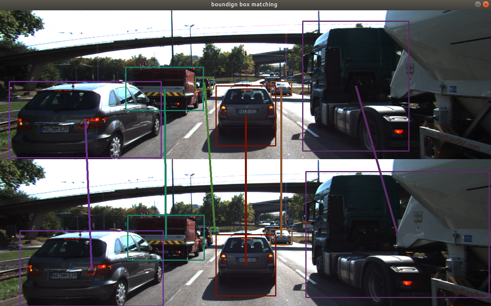
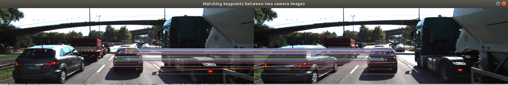
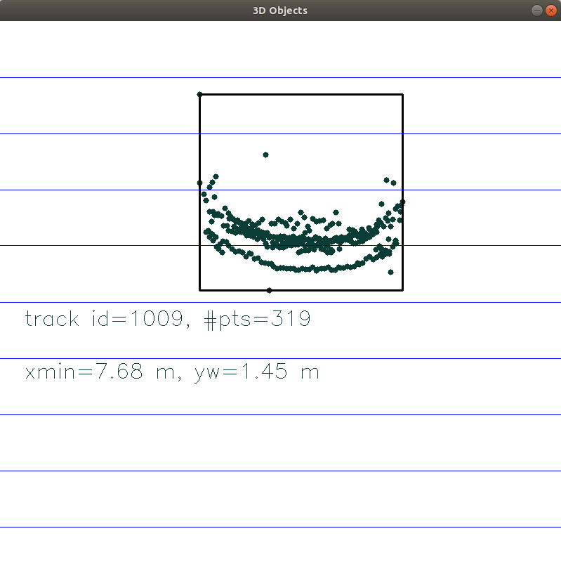
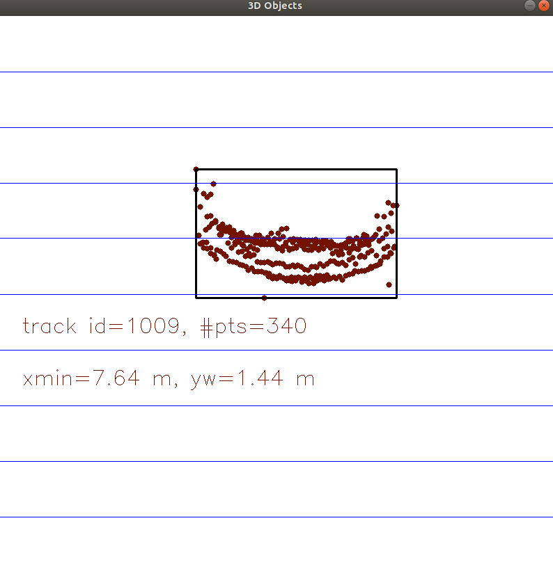
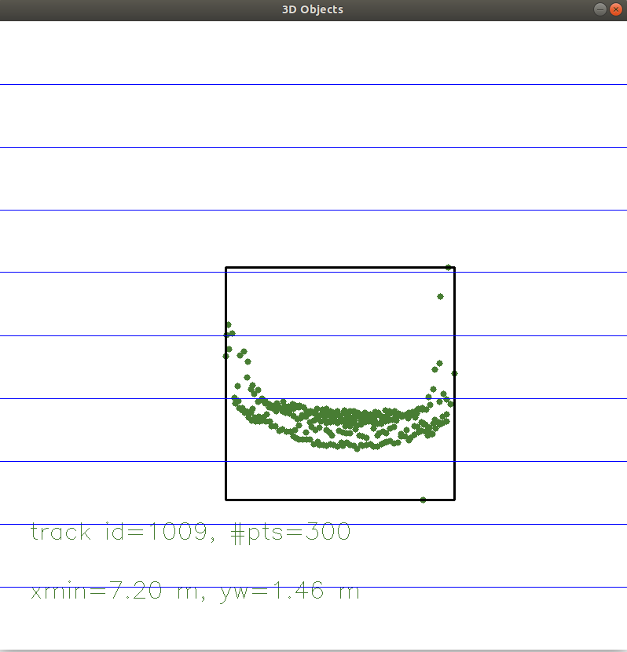
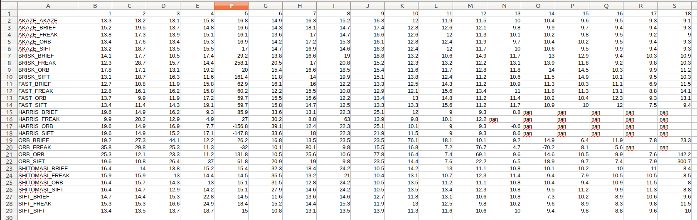
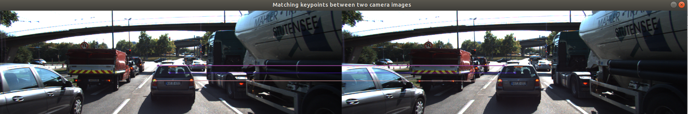
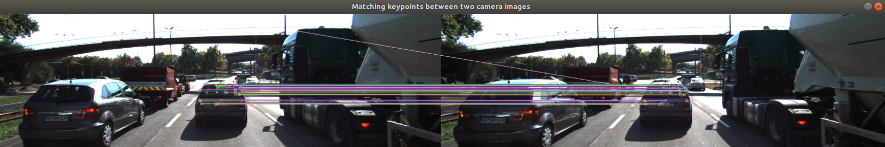
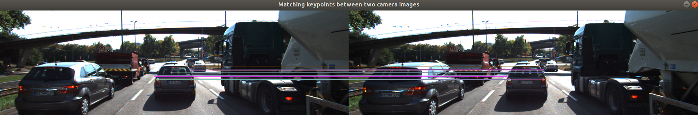

# SFND 3D Object Tracking

Course project for Udacity Sensor Fusion Engineer Nanodegree Program

This project predicts the time to colission (TTC) with preceding car by utilzing raw data from both lidar and camera sensors. Below is the overall system architecture. Note that the yellow bounding box part regarding keypoint/descriptoer/matching has been implemented in [last feature tracking project](https://github.com/LevinJ/SFND_2D_Feature_Tracking).


In this  project, we implement the missing parts in the schematic. 
1. First, develop a way to match 3D objects over time by using keypoint correspondences. 
2. Second, compute the TTC based on Lidar measurements. 
3. Proceed to do the same using the camera, which requires to first associate keypoint matches to regions of interest and then to compute the TTC based on those matches. 
4. And lastly, conduct various tests with the framework. The goal is to identify the most suitable detector/descriptor combination for TTC estimation and also to search for problems that can lead to faulty measurements by the camera or Lidar sensor. 


##  Match 3D Objects

Keypoints/descriptors extracted from camera sensor are used to match bounding box between previous frame and current frame. The actual implementation is quite straightforward,

1. Set up a matrix, the row consists of all bounding boxes in previous frame, and the column consists of all bounding boxes in current frame. Initially all the cells in the matrix is filled with 0.
2. Enumerate all keypoint matching, add 1 to the matrix cell if the matched keypoints belong to the bounding boxes corresponding to the matrix cell.
3. For each bouding box in the previous frame, set its matching bounding box as the one from current frame which contains maximum matched keypoints.

Below is an example of bounding box matching.




## Compute Lidar-based TTC

Lidar based TTC estimate is calcuated by below formula

```
TTC = minXCurr * dT / (minXPrev - minXCurr);
```

Here `minXCurr` refers to the clostest point of preceding car in current frame, and `minXPrev` refers to that in previous frame, `dT` refers to the duration between previous and current frame. So we are using a constant velocity model to estiamte TTC.

Sensor noise is unavoidable, and we are getting some ghost point between the preceding car and ego car. If we take those ghost point as the closest point, TTC estimate is bound to be off. To remove those outliers, we pick the Nth closet point as the closest point of preceding car. Detection boudning box shrink is also applied to reduce outliers. More about this will be discussed in Performance Evaluation 1 section.

## Associate Keypoint Correspondences with Bounding Boxes

Before calculating the TTC of preceding car, we first obtains all the keypoints extracted in the bounding box of preceding car. This is implemented in `clusterKptMatchesWithROI` method. To be more robust to outliers, a shrinking boudning box is used to fitler out keypoints are not part of the preceding car. Also IQR is applied to euclidean distance ratio between current frame and previous to reduce outliers.

Below is an examle result of associating kyepoints with bounding box



## Compute Camera-based TTC

Using  keypoint correspondences from the matched bounding boxes between current and previous frame, TTC estimate is calculated. Math formula is as below,

```
double ratio = distCurr / distPrev;
TTC = -dT / (1 - ratio);
```

`distCurr` is the distance between two keypoints in current frame, and `distPrev` is the distance between corresponding matched keypoints in previous frame. `dT` refers to the duration between previous and current frame. 

To remove those outliers caused by keypoint mismatch, we apply interquartile range test to all the `ratio` data in the bounding box. 

##  Performance Evaluation 1 (lidar TTC)

Lidar based TTC could be off, the main root cause could be that the closest point obtained may be a ghost point, may not be an actual point in the preceding car. Below are a few examples,







Based on observations on outlier pattern in exisiting data set, we decide to use the Nth (specifically 7th) of the closest point as the closet point to compute TTC.  


##  Performance Evaluation 2 (Camera TTC)

Using all combinations of detector/descriptor implemented in last project, a spreadsheet containing all the TTC estimates on a frame by frame basis are obtained as below,



A few interesting points,

1. "nan" TTC estimate

This happens as some combinations is not stable engough and is not able to find sufficient qualified keypoint match located in preceding car, as illustrated in below sample,



2. As there are no ground truth for TTC to compare the performance, we can't get an objective omparision among the detector/descriptor combinations. This feature is implemented in the `Performance_eval2` function in FinalProject_Camera.cpp file. Here are the keypoint matching sample for the three recommended combinations in last project.

1) FAST-BRIEF

2) ORB-ORB

3) FAST-SIFT


Overall, I would say all the three combinations look very good, and ORB-ORB could be the best as it can hanlle orientation change bewteen subsequent image frames, and is probably able to do a better job in curved road.


## Refelction

This project builds a pipeline to estimate time to collision with preceding car by useing both ldiar point and camera image, which is a very cool. a few takeaway,

1. The idea of using keypoints/descriptor to track 3d bounding box is very appealing, and is expected to perform much more robost than distance based tracking method.
2. As no ground truth TTC is provided, we are not able to get an thorough evaluation on the accuary of current pipeline.
3. There are various hard coded parameters in the pipeline, the robutstness of the pipeline to unseen data/scenario remains to be tested.
4. Using EKF to fuse ldiar and camera ttc shoudl be able to improve the robustness of the pipeline.


